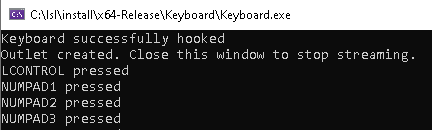

# Keyboard / Mouse connector apps

These programs grab all input events
(keystrokes and releases, mouse clicks, mouse movements)
done at a computer to allow for
recording input events for example while closed-source stimulus presentation
software is running.

Note that no passwords or personal information should be entered while this
program is running.
Also keep in mind that this program must run on the stimulus presentation PC.

# Usage

1. Start the Keyboard / Mouse app. You should see a window like the following.
   

2. You should now have a stream on your lab network that has
   name "Keyboard" and type "Markers" (Keyboard) /
   two streams "MouseButtons" with type "Markers" and "MousePosition" (Mouse).
   The marker streams contain a single channel of irregular sampling rate with
   string-formatted values each time a key/mouse button is pressed or released.
   The "MousePosition" stream is an irregularly sampled streams with the X and
   Y positions.


# Keyboard Event Names
The following list contains the names assigned to the various key codes
(corresponding to Windows virtual key codes in the same order).

The events are of the form "KEYNAME pressed" or "KEYNAME released":

```
RESERVED00, LBUTTON, RBUTTON, CANCEL, MBUTTON, XBUTTON1, XBUTTON2, BELL, BACK,
TAB, RESERVED0A, RESERVED0B, CLEAR, RETURN, RESERVED0E, RESERVED0F, SHIFT,
CONTROL, MENU, PAUSE, CAPITAL, KANA, RESERVED16, JUNJA, FINAL, KANJI,
UNASSIGNED1A, ESCAPE, CONVERT, NONCONVERT, ACCEPT, MODECHANGE, SPACE, PRIOR,
NEXT, END, HOME, LEFT, UP, RIGHT, DOWN, SELECT, PRINT, EXECUTE, SNAPSHOT,
INSERT, DELETE, HELP, 0, 1, 2, 3, 4, 5, 6, 7, 8, 9, UNASSIGNED3A, UNASSIGNED3B,
UNASSIGNED3C, UNASSIGNED3D, UNASSIGNED3E, UNASSIGNED3F, UNASSIGNED40, A, B, C,
D, E, F, G, H, I, J, K, L, M, N, O, P, Q, R, S, T, U, V, W, X, Y, Z,
LWIN, RWIN, APPS, RESERVED5E, SLEEP,
NUMPAD0, NUMPAD1, NUMPAD2, NUMPAD3, NUMPAD4, NUMPAD5, NUMPAD6, NUMPAD7,
NUMPAD8, NUMPAD9, MULTIPLY, ADD, SEPARATOR, SUBTRACT, DECIMAL, DIVIDE,
F1, F2, F3, F4, F5, F6, F7, F8, F9, F10, F11, F12, F13, F14, F15, F16, F17,
F18, F19, F20, F21, F22, F23, F24,
UNASSIGNED88, UNASSIGNED89, UNASSIGNED8A, UNASSIGNED8B, UNASSIGNED8C,
UNASSIGNED8D, UNASSIGNED8E, UNASSIGNED8F, NUMLOCK, SCROLL, OEM_FJ_JISHO,
OEM_FJ_MASSHOU, OEM_FJ_TOUROKU, OEM_FJ_LOYA, OEM_FJ_ROYA, UNASSIGNED97,
UNASSIGNED98, UNASSIGNED99, UNASSIGNED9A, UNASSIGNED9B, UNASSIGNED9C,
UNASSIGNED9D, UNASSIGNED9E, UNASSIGNED9F, LSHIFT, RSHIFT, LCONTROL, RCONTROL,
LMENU, RMENU, BROWSER_BACK, BROWSER_FORWARD, BROWSER_REFRESH, BROWSER_STOP,
BROWSER_SEARCH, BROWSER_FAVORITES, BROWSER_HOME, VOLUME_MUTE, VOLUME_DOWN,
VOLUME_UP, MEDIA_NEXT_TRACK, MEDIA_PREV_TRACK, MEDIA_STOP, MEDIA_PLAY_PAUSE,
LAUNCH_MAIL, LAUNCH_MEDIA_SELECT, LAUNCH_APP1, LAUNCH_APP2, RESERVEDB8,
RESERVEDB9, US_SEMICOLON, PLUS, COMMA, MINUS, PERIOD, US_SLASH, US_TILDE,
RESERVEDC1, RESERVEDC2, RESERVEDC3, RESERVEDC4, RESERVEDC5, RESERVEDC6,
RESERVEDC7, RESERVEDC8, RESERVEDC9, RESERVEDCA, RESERVEDCB, RESERVEDCC,
RESERVEDCD, RESERVEDCE, RESERVEDCF, RESERVEDD0, RESERVEDD1, RESERVEDD2,
RESERVEDD3, RESERVEDD4, RESERVEDD5, RESERVEDD6, RESERVEDD7, UNASSIGNEDD8,
UNASSIGNEDD9, UNASSIGNEDDA, US_SQUARE_BRACKET_OPEN, US_BACKSLASH,
US_SQUARE_BRACKET_CLOSE, US_QUOTE, OEM_8, RESERVEDE0, OEM_AX, OEM_102,
ICO_HELP, ICO_00, PROCESSKEY, ICO_CLEAR, PACKET, RESERVEDE8, OEM_RESET,
OEM_JUMP, OEM_PA1, OEM_PA2, OEM_PA3, OEM_WSCTRL, OEM_CUSEL, OEM_ATTN,
OEM_FINISH, OEM_COPY, OEM_AUTO, OEM_ENLW, OEM_BACKTAB, ATTN, CRSEL, EXSEL,
EREOF, PLAY, ZOOM, NONAME, PA1, OEM_CLEAR, RESERVEDFF
```

# Mouse event names

The events are of the form "ButtonName pressed" or "ButtonName released":

- MouseButtonLeft
- MouseButtonRight
- MouseButtonMiddle
- MouseButtonX*n* where *n* is the index of the additional mouse button
- MouseWheelUp*n* where *n* is the scroll distance (default 120)
- MouseWheelLeft
- MouseWheelRight
